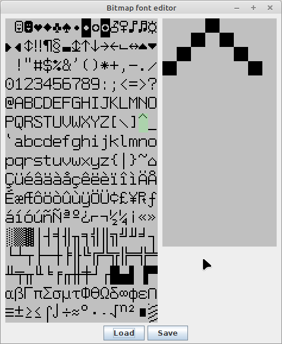

# Bitmap font editor

This is a simple editor for bitmap fonts. Although in theory it could handle fonts with
characters of arbitrary dimensions, in practice it's only useful for fonts where characters
are exactly 8 pixels wide. It supports loading and saving binary font data, i.e.,
data that could be written into the font ROM on a graphics card.

I'm using this program so that I can load, view, and (if I want to) edit
8x16 VGA fonts for my [Hardware VGA text mode](https://github.com/daveho/HW_VGA)
implementation.

This program is very basic, but it has just functionality to be useful for me.
YMMV.

The `Main` class has a main method which runs the application.

There is no error handling.

See `font2.txt` for an example data file.

Screenshot:

