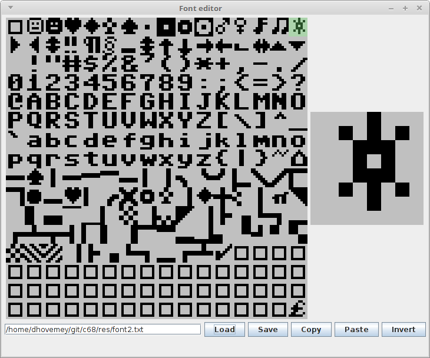

# 8x8 bitmap font editor

This is a simple editor for an 8x8 bitmap font.  The `Main` class has a main method which runs the application.

There is no error handling.

See `font2.txt` for an example data file.

Screenshot:

